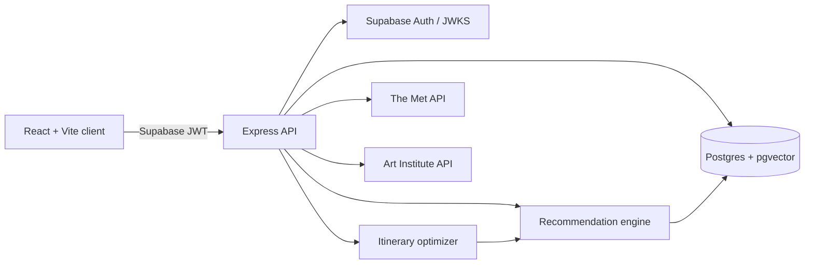
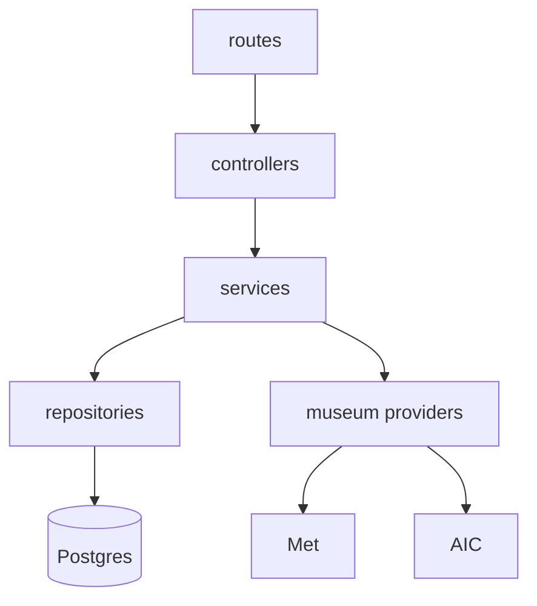
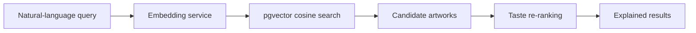
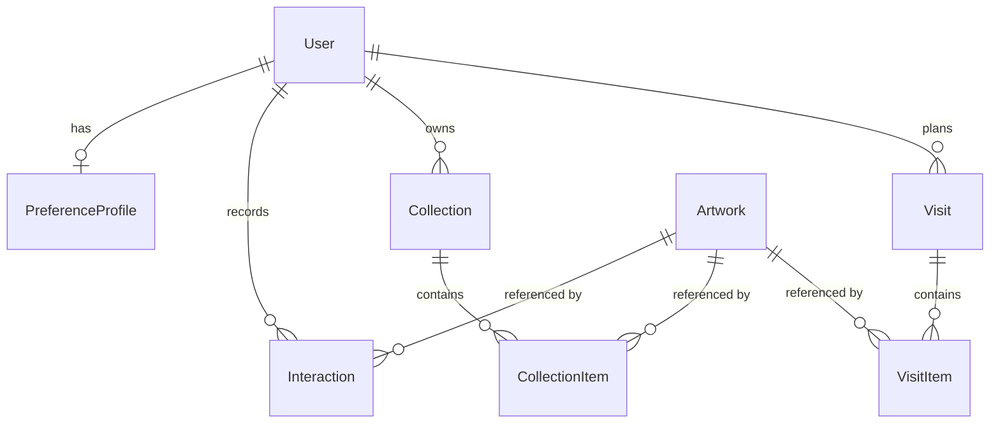

# MuseMatch

MuseMatch is a personalized museum discovery and visit-planning application. It combines normalized
collection data from The Metropolitan Museum of Art and the Art Institute of Chicago with an
explicit taste quiz and lightweight behavioral learning. People can discover explained matches, save
collections, and generate a realistic route within a visit time budget.

The problem it addresses: museum catalogues are organized around departments, periods and artists —
useful to an expert, overwhelming to a first-time visitor who does not yet know which wing they
would enjoy. MuseMatch starts from the visitor instead of the catalogue.

---

## Contents

- [Architecture](#architecture)
- [Technology stack](#technology-stack)
- [Features](#features)
- [Local setup](#local-setup)
- [Environment variables](#environment-variables)
- [Database](#database)
- [Commands](#commands)
- [How the recommendation engine works](#how-the-recommendation-engine-works)
- [How museum APIs are normalized](#how-museum-apis-are-normalized)
- [How semantic search works](#how-semantic-search-works)
- [How the itinerary optimizer works](#how-the-itinerary-optimizer-works)
- [API reference](#api-reference)
- [Data model](#data-model)
- [Testing and evaluation](#testing-and-evaluation)
- [Current limitations](#current-limitations)
- [Future improvements](#future-improvements)
- [Production checklist](#production-checklist)

---

## Architecture



A modular monolith, deliberately. There is no queue, no second service and no separate ML tier,
because nothing in the product needs one yet.

The layering inside the server is what carries the weight:



Routes only route. Controllers validate input and shape responses. Services hold the business rules.
Repositories own the database. Provider classes are the only code that knows a museum's API exists.

### Repository layout

```
musematch/
├── client/    React app: api/, components/, features/, pages/, stores/
├── server/    Express API: routes/, controllers/, services/, repositories/, prisma/
└── shared/    Types, taste vocabulary, quiz definition and constants used by both
```

`shared` is what keeps the two halves honest. The quiz questions, the taste vocabulary, the artwork
model and the match-percentage formula are defined once and imported by both sides, so the client
cannot render a question the server will not accept, or display a match figure computed differently.

The browser never queries application tables directly and never receives a Supabase service-role
credential. The API derives identity from a verified access token; user IDs in request bodies are
ignored.

---

## Technology stack

| Layer     | Choice                                                                          |
| --------- | ------------------------------------------------------------------------------- |
| Client    | React 18, TypeScript, Vite, Tailwind, Radix primitives, TanStack Query, dnd-kit  |
| State     | TanStack Query for server data; Zustand only for client-only UI state (toasts)   |
| Server    | Node 20+, Express, TypeScript (strict), Zod, Pino                                |
| Database  | PostgreSQL 17 with pgvector                                                      |
| ORM       | Prisma                                                                           |
| Identity  | Supabase Auth (JWT verified server-side)                                         |
| Embeddings| OpenAI `text-embedding-3-small`, behind a provider interface, with a local fallback |

---

## Features

- **Taste onboarding** — eight questions, served by the API so the client renders exactly what the
  server validates.
- **Explained recommendations** — every card carries a match percentage and one to three
  plain-language reasons.
- **Cross-museum discovery** — keyword search across both collections, plus filters over the local
  cache.
- **Semantic search** — natural-language queries resolved through pgvector, re-ranked by taste.
- **Collections** — create, rename, delete, add and remove works.
- **Visit planner** — pick a museum and a time budget; get an optimized, editable, drag-and-drop
  itinerary grouped into walking stops.
- **Taste dashboard** — top mediums, eras, themes and styles, activity totals, and a rule-based art
  personality.

---

## Local setup

Prerequisites: Node.js 20+, npm, and Docker Desktop (or another PostgreSQL 17 install with pgvector).

1. Install dependencies with `npm install`.
2. Copy `.env.example` to `.env`. For zero-configuration local identity, set both
   `DEV_AUTH_BYPASS=true` and `VITE_DEV_AUTH_BYPASS=true`. This bypass is rejected in production.
3. Start Postgres, migrate, and seed:

   ```bash
   npm run db:up
   npm run db:migrate
   npm run db:seed
   ```

4. Start the API and web app with `npm run dev`.

Open `http://localhost:5173`. The API is served at `http://localhost:4000/api`; `/api/health` is a
health check.

The first seed fetches ~50 real works from the two museum APIs and writes them to
`server/prisma/fixtures/artworks.json`. Every later seed reads that file, so the dataset is
deterministic and the whole frontend can be developed offline. Delete the fixture to refresh it.
Museum metadata is never hand-written, because that would mean inventing facts about real objects.

### Supabase authentication

Create a Supabase project, configure email confirmation and redirect URLs, and set `SUPABASE_URL`,
`VITE_SUPABASE_URL`, and `VITE_SUPABASE_ANON_KEY`. Set `SUPABASE_JWT_SECRET` for local HS256
verification, or leave it empty to verify against the project's JWKS endpoint. Keep both development
bypass flags false for deployed environments.

If using Supabase-hosted Postgres, use a server-side connection string only. Application tables
should not be exposed to `anon` or `authenticated` through the Data API; enable suitable RLS or
revoke those roles before deployment. MuseMatch's React client talks only to Express.

---

## Environment variables

One `.env` at the repository root serves both workspaces. The server resolves it relative to its own
source rather than to the working directory; Vite reads it via `envDir`.

| Variable                    | Required | Notes                                                              |
| --------------------------- | -------- | ------------------------------------------------------------------ |
| `DATABASE_URL`              | yes      | Postgres connection string                                          |
| `PORT`, `LOG_LEVEL`         | no       | Default `4000`, `info`                                              |
| `CLIENT_ORIGIN`             | no       | CORS allow-list, comma separated                                    |
| `SUPABASE_URL`              | prod     | Used as the token issuer and to locate the JWKS                     |
| `SUPABASE_JWT_SECRET`       | no       | Set for local HS256 verification instead of a JWKS fetch            |
| `DEV_AUTH_BYPASS`           | no       | Dev only; accepts `x-dev-user`. Startup fails if true in production |
| `OPENAI_API_KEY`            | no       | Absent → deterministic local embedding provider                     |
| `EMBEDDING_PROVIDER`        | no       | `openai` or `local`; inferred from the key when unset               |
| `MET_API_BASE_URL`, `AIC_API_BASE_URL` | no | Overridable for tests                                        |
| `MUSEUM_REQUEST_TIMEOUT_MS` | no       | Default 8000                                                        |
| `MUSEUM_USER_AGENT`         | no       | Both museums ask callers to identify themselves                     |
| `VITE_API_BASE_URL`         | no       | Default `http://localhost:4000/api`                                 |
| `VITE_SUPABASE_URL`, `VITE_SUPABASE_ANON_KEY` | prod | Publishable values only                            |
| `VITE_DEV_AUTH_BYPASS`      | no       | Client mirror of `DEV_AUTH_BYPASS`                                  |

Every variable is parsed and bounded in `server/src/config/env.ts`; nothing else reads
`process.env`. A key present but blank counts as unset.

---

## Database

`docker compose up -d` starts `pgvector/pgvector:pg17` on port **5433** (not 5432, to avoid
colliding with an existing local Postgres).

Two migrations: the initial schema, and an HNSW index on the embedding column. HNSW rather than
IVFFlat because it needs no training pass over existing rows, so it stays correct while the artwork
cache is still filling up.

Prisma cannot select or write an `Unsupported("vector")` column, so `embeddingRepository` is the one
place in the codebase that uses raw SQL. Every value still goes through a bound parameter — the
vector is passed as a text literal and cast in the query, never interpolated into the statement.

The Prisma CLI only looks for a `.env` beside the schema, so the `db:*` scripts go through
`server/scripts/prisma.ts`, which loads the real config and passes `DATABASE_URL` through. That
avoids a second copy of the connection string that would eventually drift.

---

## Commands

```bash
npm run dev            # API and client in parallel
npm run build          # server and production client bundle
npm run typecheck      # all three workspaces
npm run lint           # server and client ESLint
npm test               # server unit and integration tests
npm run format         # Prettier over all source

npm run db:up          # start Postgres
npm run db:migrate     # create/apply migrations
npm run db:seed        # seed artworks, a dev user, collections and a visit
npm run db:studio      # Prisma Studio
```

Workspace-scoped maintenance commands:

```bash
npm run embeddings:backfill  --workspace @musematch/server            # embed cached artworks
npm run embeddings:backfill  --workspace @musematch/server -- --reset # after changing provider
npm run db:reclassify        --workspace @musematch/server            # after editing taxonomy rules
npm run eval:recommendations --workspace @musematch/server            # print synthetic-visitor rankings
```

API integration tests require a disposable migrated database and the development auth bypass. Do not
point them at production or shared data.

---

## How the recommendation engine works

Scoring lives in `server/src/services/recommendations/`. Every tunable number is in `config.ts`;
there are no recommendation constants scattered elsewhere.

**Step 1 — the taste profile.** The quiz produces *explicit* weights. Each option declares its own
contributions, so the meaning of an answer lives with the answer rather than in a separate mapping
table. Multi-select answers decay by rank (0.85 per position), so a first pick counts for more than a
third. Each dimension is then normalized to a maximum of 1, so someone who ticked one box and
someone who ticked three end up with comparable profiles rather than different magnitudes.

**Step 2 — behavior.** Interactions move a *separate* behavioral profile. The two are stored apart
and blended only at read time (behavior at 35%), which means the behavioral influence can be re-tuned
or discarded without destroying what the user originally said. Each interaction:

- decays existing weights in the touched dimensions slightly (×0.997), so abandoned interests fade
  rather than accumulating forever;
- applies a step scaled by the interaction's strength (`VIEW` +0.1 … `ADD_TO_VISIT` +1.0,
  `DISLIKE` −0.8);
- divides that step across the facets the artwork carries in a dimension, so a record tagged with
  three themes does not push three times as hard as one tagged with a single theme.

With a learning rate of 0.06, the strongest possible single signal moves a weight by under 0.1.
Taste follows a session's worth of signals, not one click.

**Step 3 — scoring one artwork.** Five taste dimensions are scored by comparing the user's weights
against the artwork's facets. Within a dimension, the best match dominates and a second match adds
15% of its weight; averaging instead would punish an artwork for carrying a theme the user is merely
neutral about. A dimension the classifier could not fill in scores 0.2 rather than 0 — a sparse
museum record is *missing information*, not evidence of a mismatch, and scoring it as one would bury
whole departments whose cataloguing happens to be terse.

The structured score weights those dimensions:

```
medium 0.25 · era 0.20 · theme 0.20 · style 0.15 · experience 0.10
```

renormalized to span [0, 1] on its own. The final score is a hybrid:

```
score = 0.45·structured + 0.25·behavior + 0.20·semantic + 0.10·exploration
```

**A note on the exploration term.** The specification gives exploration a weight in the single-stage
formula *and* in the hybrid. Counting it in both places would double its influence, so the structured
component here covers the five taste dimensions and exploration is applied once, at the hybrid level.

Exploration is not simply "reward novelty". It measures how well an artwork's novelty suits the
appetite the user asked for: `1 − |novelty − explorationSetting|`. A visitor who asked to be pushed
scores highest on unfamiliar work; a visitor who asked to stay close scores highest on familiar work.

When nothing has been embedded yet, the semantic component has nothing to say, so its weight is
redistributed across the others rather than scoring every artwork zero on a fifth of the total.

**Step 4 — explanations.** The same component values that produced the number produce the words.
Only components above a threshold generate a reason, at most three are shown, and no reason ever
contains a weight or a raw score. Match percentages are stretched for display
(`toMatchPercent` in `shared`) because raw scores cluster low and showing a genuinely strong match as
"48%" would misrepresent it. Ranking always uses the raw score, and both the feed and the itinerary
use the same formula so the same artwork never shows two different figures.

**Step 5 — diversity.** One artist may fill at most two slots in a feed page. Overflow is appended
after the diverse selection rather than discarded, so the page still fills for a visitor whose taste
genuinely centres on a few artists.

---

## How museum APIs are normalized

The two APIs have almost opposite shapes:

|                | The Met                                   | Art Institute                             |
| -------------- | ----------------------------------------- | ----------------------------------------- |
| Search returns | object IDs only, no pagination            | full records, `fields` projection, paged  |
| Detail         | one request per object                    | not needed                                |
| Images         | absolute URLs                             | IIIF base + `image_id`                    |
| Description    | none — credit line only                   | HTML                                      |

`MetMuseumProvider` therefore slices the ID list itself and hydrates only the page it needs, with a
concurrency ceiling of 8; a naive implementation would fire one request per result in the entire
match set. `ArtInstituteProvider` needs no hydration step but must assemble image URLs, which is why
a record without an `image_id` gets no image rather than a broken one.

Both funnel into `normalizeArtwork`, which enforces the rules that hold regardless of source: empty,
whitespace and placeholder values collapse to `null`, HTML is stripped, and **no value is ever
invented**. Where a museum supplies nothing, the UI says "Unknown artist" rather than guessing.

`MuseumService` fans queries out and merges results round-robin so one museum cannot fill the whole
page. Every provider call is isolated: a failure is logged, reported through `unavailable`, and the
healthy provider's results are still returned. One museum being down degrades the experience; it does
not break it.

### The taxonomy classifier

Free-text curatorial metadata becomes MuseMatch's five taste dimensions in one place:
`services/museums/taxonomy.ts`. It is a transparent keyword classifier rather than a model, because
it must be deterministic, debuggable and easy to correct.

Matches are weighted by **which field** they came from, since museum fields are not equally
informative:

| Field            | Weight for medium | Why                                          |
| ---------------- | ----------------- | -------------------------------------------- |
| `medium`         | 1.00              | States what the object is made of             |
| `classification` | 1.00              | The museum's own object type                  |
| `keywords`       | 0.70              | Provider tags and subject terms               |
| `department`     | 0.35              | Only says where the museum files it           |

Without that weighting, everything in the Met's "Painting and Sculpture of Europe" was tagged as
sculpture. The threshold sits just above the department weight, so where a museum files something is
corroborating evidence rather than sufficient evidence. Regression tests lock in the specific
mistakes that motivated each rule — a painted pot is not a painting, "ink and colour on silk" is a
painting and not a garment, and Van Gogh's asylum at Saint-Rémy is not a religious subject.

Facets are stored on `Artwork.tags` as prefixed strings (`theme:nature`), which makes them both
filterable in SQL and readable back into a typed shape on either side. After editing a rule, run
`db:reclassify` — otherwise the cache holds two generations of tags at once, which would quietly skew
recommendations toward whichever half a visitor happened to be shown.

---

## How semantic search works



The embedding provider sits behind a one-method interface; no controller ever touches an API key or
knows which vendor is configured. `EmbeddingService` also owns the *text representation* of an
artwork, so the same fields are embedded everywhere — inconsistent input text is the quickest way to
make a vector index useless. That text uses human labels ("Nature & Landscape", not `nature`) so the
document reads like the natural-language queries it will be compared against.

Retrieval pulls a neighbourhood three times the requested page size, then re-ranks it against the
user's taste profile — so two people searching the same words do not get an identical page.

The personalized feed uses the same machinery in reverse: it embeds a written description of the
user's taste and compares candidates against it, so embeddings contribute even when nobody has typed
a query.

**Without an API key**, a deterministic local provider takes over. It is a hashed bag-of-words
projection, not a learned model: it captures lexical overlap and nothing more — it has no idea that
"melancholy" and "sombre" are related. It exists so the whole vector path can be developed, seeded
and tested offline, and so a missing key degrades search rather than breaking it. Set `OPENAI_API_KEY`
for real semantic behaviour, then re-run the backfill with `--reset`: vectors from two different
models share a column but not a space, and mixing them makes every similarity score meaningless.

---

## How the itinerary optimizer works

Choosing what to see in a fixed number of minutes is a 0/1 knapsack: each candidate has a value (its
recommendation score) and a cost (estimated dwell time), and the visit cannot exceed the budget.

Three stages, each with one job:

1. **Rank** — score the museum's cached works against the visitor's profile.
2. **Filter** — apply diversity caps: at most 2 works per artist, 4 per department.
3. **Select** — solve the time budget exactly, by dynamic programming over integer minutes.

**The central tradeoff.** Expressing the diversity caps *inside* the knapsack would make it
multi-dimensional, which is NP-hard and no longer exactly solvable. Applied as a pre-filter, the
optimizer stays optimal over a candidate set that already satisfies them. The cost is that the result
is optimal for the filtered set rather than for every possible diverse itinerary. In exchange the
behaviour is predictable and fast, and a visitor never gets four Monets and nothing else.

The DP is used rather than a greedy value-per-minute pass because greedy can be arbitrarily worse,
and "the plan skipped the best thing in the museum" is exactly the failure a visitor would notice.
At roughly 80 candidates against a budget under ten hours the table is a few tens of thousands of
cells and runs in well under a millisecond.

Dwell times are planning conventions, not measurements: 10 minutes standard, 15 for a flagged
highlight or a work with a long curatorial description, 20 for an installation. 15 minutes are held
back from every budget for arrival and walking between wings, so a plan is not built on the fiction
that a visitor teleports between galleries.

Ordering groups works by department. Neither museum API exposes reliable gallery coordinates, so
anything finer would be invented — and a route built on invented positions is worse than an honest
grouping. Within a wing the strongest match comes first, so a visitor who runs short of time has
already seen the best of it.

Manual reordering is available by pointer and by keyboard. Regenerating replaces the plan rather than
merging into it, because a half-regenerated itinerary is neither the optimizer's answer nor the
user's.

---

## API reference

All routes are under `/api`. Everything except `/api/health` and `/api/onboarding/quiz` requires a
verified token. Success responses are `{ data }` (plus `pagination` for lists); errors are
`{ error: { code, message, details? } }`.

| Method | Path | Purpose |
| ------ | ---- | ------- |
| `GET` | `/health` | Liveness |
| `GET` | `/onboarding/quiz` | Quiz definition (public) |
| `GET` `PUT` | `/profile` | Read / update the local profile |
| `GET` `PUT` | `/profile/preferences` | Taste profile and exploration setting |
| `GET` | `/profile/dashboard` | Rankings, activity totals, art personality |
| `POST` | `/profile/onboarding` | Submit quiz answers |
| `GET` | `/artworks` | Filtered browse over the local cache |
| `GET` | `/artworks/search` | Live keyword search, or `semantic=true` |
| `GET` | `/artworks/:id` | Detail, saved state, and match explanation |
| `GET` | `/artworks/:id/similar` | Vector neighbours, with a facet fallback |
| `GET` | `/recommendations` | The personalized feed |
| `POST` | `/interactions` | Record a behavioral signal |
| `GET` `POST` | `/collections` | List / create |
| `GET` `PATCH` `DELETE` | `/collections/:id` | Read / rename / delete |
| `POST` `DELETE` | `/collections/:id/items[/:artworkId]` | Add / remove a work |
| `GET` `POST` | `/visits` | List / create |
| `GET` `PATCH` `DELETE` | `/visits/:id` | Read / update / delete |
| `POST` | `/visits/:id/generate` | Run the optimizer |
| `POST` `DELETE` | `/visits/:id/items[/:artworkId]` | Add / remove a stop |
| `PUT` | `/visits/:id/reorder` | Apply a drag-and-drop ordering |

---

## Data model



Identity lives in Supabase Auth; everything application-specific lives locally and references the
Supabase user UUID through `User.supabaseUserId`.

`Artwork` is unique on `(source, externalId)`. Every artwork the API hands out is persisted first, so
interactions, collections and visits always have a stable local ID to point at — external IDs alone
are not unique across museums and would not survive a provider changing its response shape. Uniqueness
is also enforced on `(collectionId, artworkId)` and `(visitId, artworkId)`.

---

## Testing and evaluation

100 tests across six files, covering the areas where a regression would be expensive:

- **Normalization and classification** — provider shapes, missing-field handling, HTML stripping, and
  the specific misclassifications that motivated the weighted classifier.
- **Scoring** — determinism, bounded output, differential ranking between profiles, semantic-weight
  redistribution, and that explanations never leak internals.
- **Preference learning** — rank decay, normalization, clamping, decay-on-negative, and that one
  interaction cannot swing a profile.
- **Itinerary** — that the knapsack is genuinely optimal (a case a greedy pass would fail), never
  exceeds budget, and that diversity caps and department grouping hold together.
- **API** — auth rejection, no stack-trace leakage, ownership isolation between two users, validation
  failures, and that interactions attach to the *token's* user rather than a body field.

Ranking quality is checked separately, because "the function executed" proves nothing. Three
synthetic visitors — a landscape lover, a contemporary experimentalist and a Renaissance
portraiture enthusiast — each declare the facets their top results ought to carry.
`npm run eval:recommendations` prints what each would actually be shown against the real cached
collection, which is the thing to *read* after changing a weight.

---

## Current limitations

- Provider responses are normalized before reaching the client, and missing images or metadata
  degrade gracefully — but the classifier reads words, not images, so an untitled abstract canvas
  with a sparse record is classified thinly.
- Keyword search can return partial results with a visible museum-availability warning. If all
  providers fail, the API falls back to cached works.
- The local cache grows as people search; a fresh seed has a smaller browse and recommendation pool.
- Sorting a live keyword search by date orders the page being viewed, not the whole match set —
  neither provider supports a sorted keyword query. Filters other than museum apply to the cache.
- Museum APIs do not provide authoritative indoor routing, live gallery closures, or walking
  distances. Department grouping is a planning aid, not turn-by-turn navigation.
- Viewing times are editorial estimates, not measurements.
- Semantic quality depends on the configured embedding model and whether the cache has been
  backfilled. The local fallback matches words, not meaning.
- Behavioral learning has no cold-start protection beyond the quiz, and no decay over wall-clock time
  — only over subsequent interactions.
- Email delivery and redirect behavior depend on the Supabase Auth project configuration.
- Deployment is out of scope; there is no CI pipeline or hosting configuration in this repository.

---

## Future improvements

Roughly in order of value:

- **Recommendation feedback** — explicit "more like this" / "less like this" on a card, feeding a
  stronger signal than the current like/dislike.
- **More providers** — Cleveland, Harvard Art Museums, Rijksmuseum and the Smithsonian all publish
  open APIs. The `MuseumProvider` interface is the only thing a new source needs to implement.
- **Real gallery routing** — if trustworthy floor/gallery coordinates become available, replace
  department grouping with distance-aware ordering.
- **Collaborative visits** — shared itineraries for a group, with a fairness objective
  (maximize the minimum participant's satisfaction rather than the average, so nobody's day is
  optimized away).
- **Shareable read-only collection links.**
- **Offline-evaluated weight tuning** — the evaluation harness is the scaffolding for this; the
  missing piece is a larger labelled set than three synthetic visitors.
- **Caching layer** — the Met's ID-list-then-hydrate pattern is the obvious first candidate if
  search latency becomes a problem. Not before.

---

## Production checklist

- Disable both development auth bypass flags.
- Keep `.env` uncommitted and expose only the Supabase anon key to Vite.
- Restrict database network access and Data API roles; apply RLS if tables are exposed.
- Run migrations, seed or warm the artwork cache, and backfill embeddings.
- Set the exact deployed `CLIENT_ORIGIN`, provider timeout, and a descriptive museum user agent.
- Run `npm run typecheck`, `npm run lint`, `npm test`, and `npm run build` in CI.
